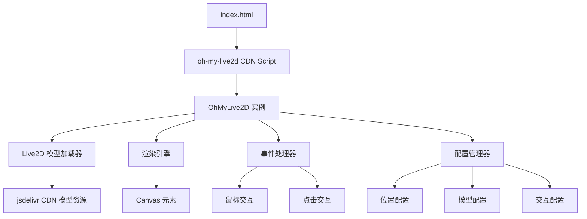
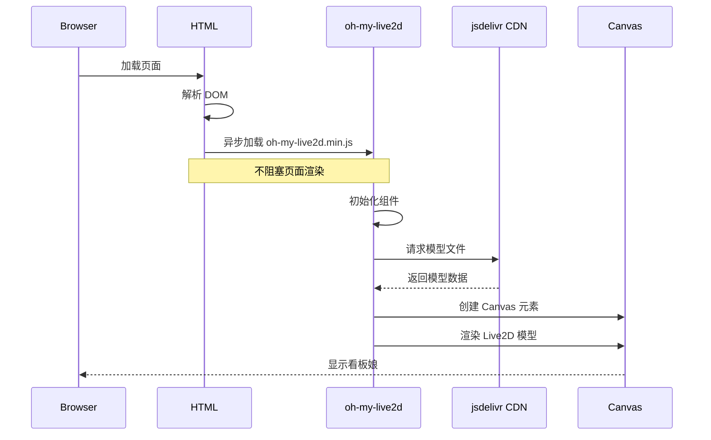

# 设计文档

## 概述

本设计文档描述了如何在现有音乐网站中集成 oh-my-live2d 组件和 zenghongtu/live2d-model-assets 模型库。该实现将通过 CDN 方式引入 oh-my-live2d，使用 jsdelivr CDN 加载模型资源，并通过 JavaScript 配置实现自定义功能。

### 设计目标

- 最小化对现有代码的侵入性
- 确保异步加载不影响页面性能
- 提供灵活的配置选项
- 支持响应式设计
- 保持代码简洁易维护

## 架构

### 整体架构图



### 加载流程



## 组件和接口

### 1. HTML 集成层

**文件**: `index.html`

**职责**: 
- 引入 oh-my-live2d CDN 脚本
- 提供初始化配置
- 确保脚本异步加载

**实现方式**:
```html
<!-- 在 </body> 标签前添加 -->
<script src="https://cdn.jsdelivr.net/npm/oh-my-live2d@latest/dist/index.min.js"></script>
<script src="./JS/live2d-config.js"></script>
```

### 2. 配置模块

**文件**: `JS/live2d-config.js`

**职责**:
- 定义 Live2D 组件的配置选项
- 初始化 OhMyLive2D 实例
- 处理配置错误

**接口定义**:
```javascript
// 配置对象结构
interface Live2DConfig {
  models: ModelConfig[];      // 模型配置数组
  tips: TipsConfig;           // 提示配置
  statusBar: StatusBarConfig; // 状态栏配置
  menus: MenusConfig;         // 菜单配置
  primaryColor: string;       // 主题色
  sayHello: boolean;          // 是否显示问候语
}

interface ModelConfig {
  path: string;               // 模型路径
  scale: number;              // 缩放比例
  position: [number, number]; // 位置 [x, y]
  stageStyle: {
    width: number;            // 舞台宽度
    height: number;           // 舞台高度
  };
}
```

**配置示例**:
```javascript
const live2dConfig = {
  models: [
    {
      path: 'https://cdn.jsdelivr.net/gh/zenghongtu/live2d-model-assets@master/assets/hijiki/hijiki.model.json',
      scale: 0.1,
      position: [0, 50],
      stageStyle: {
        width: 250,
        height: 350
      }
    }
  ],
  tips: {
    style: {
      width: 230,
      height: 70,
      left: '10px',
      top: '-60px'
    },
    mobileStyle: {
      width: 180,
      height: 60,
      left: '10px',
      top: '-60px'
    }
  },
  statusBar: {
    disable: false,
    transitionTime: 800
  },
  menus: {
    disable: false,
    items: [
      {
        id: 'Rest',
        icon: 'icon-rest',
        title: '休息',
        onClick: (oml2d) => {
          oml2d.stageSlideOut();
        }
      },
      {
        id: 'SwitchModel',
        icon: 'icon-switch',
        title: '切换模型',
        onClick: (oml2d) => {
          oml2d.loadNextModel();
        }
      },
      {
        id: 'About',
        icon: 'icon-about',
        title: '关于',
        onClick: () => {
          window.open('https://github.com/oh-my-live2d/oh-my-live2d');
        }
      }
    ]
  },
  primaryColor: 'var(--primary-color, #38B0DE)',
  sayHello: true
};
```

### 3. 模型资源管理

**模型来源**: zenghongtu/live2d-model-assets

**CDN 路径格式**:
```
https://cdn.jsdelivr.net/gh/zenghongtu/live2d-model-assets@master/assets/{model-name}/{model-name}.model.json
```

**可用模型列表** (部分):
- hijiki
- tororo
- izumi
- koharu
- shizuku
- miku
- z16

**模型选择策略**:
1. 默认使用 `hijiki` 模型（轻量且可爱）
2. 支持通过配置切换其他模型
3. 可配置多个模型实现随机或手动切换

### 4. 交互处理模块

**职责**:
- 处理鼠标悬停事件（视线跟随）
- 处理点击事件（触发动画）
- 处理菜单交互
- 管理模型状态

**事件绑定**:
```javascript
// oh-my-live2d 内置事件处理
// 鼠标跟随 - 自动启用
// 点击交互 - 自动启用
// 自定义事件可通过 API 添加
```

### 5. 响应式适配模块

**职责**:
- 检测设备类型和屏幕尺寸
- 调整模型大小和位置
- 在小屏幕设备上优化显示

**实现策略**:
```javascript
// 移动端适配
const isMobile = /Android|webOS|iPhone|iPad|iPod|BlackBerry|IEMobile|Opera Mini/i.test(navigator.userAgent);

if (isMobile) {
  // 调整模型配置
  live2dConfig.models[0].scale = 0.08;
  live2dConfig.models[0].stageStyle.width = 200;
  live2dConfig.models[0].stageStyle.height = 280;
}
```

## 数据模型

### 配置数据结构

```typescript
// 主配置
type OhMyLive2DOptions = {
  models: ModelOptions[];
  tips?: TipsOptions;
  statusBar?: StatusBarOptions;
  menus?: MenusOptions;
  primaryColor?: string;
  sayHello?: boolean;
  importType?: 'complete' | 'cubism2' | 'cubism5';
  libraryUrls?: {
    complete?: string;
    cubism2?: string;
    cubism5?: string;
  };
};

// 模型选项
type ModelOptions = {
  path: string;
  scale?: number;
  position?: [number, number];
  stageStyle?: {
    width?: number;
    height?: number;
    bottom?: string;
    right?: string;
    left?: string;
  };
  mobileScale?: number;
  mobilePosition?: [number, number];
  mobileStageStyle?: {
    width?: number;
    height?: number;
  };
};

// 提示选项
type TipsOptions = {
  style?: CSSProperties;
  mobileStyle?: CSSProperties;
  idleTips?: {
    wordTheDay?: boolean;
    message?: string[];
    duration?: number;
    interval?: number;
    priority?: number;
  };
};

// 菜单选项
type MenusOptions = {
  disable?: boolean;
  items?: MenuItem[];
};

type MenuItem = {
  id: string;
  icon: string;
  title: string;
  onClick: (oml2d: OhMyLive2D) => void;
};
```

### 模型文件结构

```
model.json (模型配置文件)
├── textures/     (纹理文件)
├── motions/      (动作文件)
└── expressions/  (表情文件)
```

## 错误处理

### 错误类型和处理策略

1. **CDN 加载失败**
   - 错误: oh-my-live2d 脚本加载失败
   - 处理: 静默失败，不影响网站其他功能
   - 实现: 使用 `async` 属性，不添加 `onerror` 处理

2. **模型加载失败**
   - 错误: 模型文件 404 或格式错误
   - 处理: oh-my-live2d 内置错误处理，显示默认提示
   - 备选方案: 配置多个模型作为备选

3. **浏览器不兼容**
   - 错误: 浏览器不支持 WebGL
   - 处理: oh-my-live2d 自动检测并优雅降级
   - 用户提示: 不显示看板娘，不影响其他功能

4. **配置错误**
   - 错误: 配置对象格式错误
   - 处理: 使用默认配置
   - 日志: 在控制台输出警告信息

### 错误处理代码示例

```javascript
// live2d-config.js
try {
  if (typeof OhMyLive2D !== 'undefined') {
    OhMyLive2D(live2dConfig);
  } else {
    console.warn('OhMyLive2D is not loaded, Live2D feature will be disabled');
  }
} catch (error) {
  console.error('Failed to initialize Live2D:', error);
  // 静默失败，不影响网站其他功能
}
```

## 测试策略

### 1. 功能测试

**测试项目**:
- [ ] CDN 脚本正确加载
- [ ] 模型文件成功加载
- [ ] 看板娘正确显示在页面上
- [ ] 鼠标悬停时视线跟随
- [ ] 点击模型触发动画
- [ ] 菜单按钮功能正常
- [ ] 模型切换功能正常
- [ ] 休息/唤醒功能正常

### 2. 兼容性测试

**测试浏览器**:
- Chrome (最新版本)
- Firefox (最新版本)
- Safari (最新版本)
- Edge (最新版本)
- 移动端浏览器 (iOS Safari, Chrome Mobile)

**测试设备**:
- 桌面端 (1920x1080, 1366x768)
- 平板端 (768x1024)
- 移动端 (375x667, 414x896)

### 3. 性能测试

**测试指标**:
- 页面加载时间增加 < 500ms
- 内存占用 < 50MB
- CPU 使用率 < 5% (空闲状态)
- 帧率 > 30fps (动画播放时)

**测试方法**:
- 使用 Chrome DevTools Performance 面板
- 使用 Lighthouse 进行性能评分
- 在低性能设备上测试

### 4. 响应式测试

**测试场景**:
- 窗口大小调整时模型位置和大小适配
- 移动端横竖屏切换
- 不同分辨率下的显示效果

### 5. 手动测试清单

```markdown
## Live2D 集成测试清单

### 基础功能
- [ ] 页面加载后看板娘自动出现
- [ ] 看板娘位置正确（右下角）
- [ ] 看板娘大小合适，不遮挡内容
- [ ] 初次加载显示问候语

### 交互功能
- [ ] 鼠标移动时视线跟随
- [ ] 点击模型触发随机动画
- [ ] 点击"休息"按钮，模型滑出
- [ ] 点击唤醒按钮，模型滑入
- [ ] 点击"切换模型"按钮，加载下一个模型
- [ ] 点击"关于"按钮，打开项目页面

### 响应式
- [ ] 桌面端显示正常
- [ ] 移动端显示正常且大小适配
- [ ] 窗口缩放时模型位置保持固定

### 性能
- [ ] 页面加载速度无明显影响
- [ ] 动画流畅，无卡顿
- [ ] 长时间运行无内存泄漏

### 兼容性
- [ ] Chrome 浏览器正常
- [ ] Firefox 浏览器正常
- [ ] Safari 浏览器正常
- [ ] Edge 浏览器正常
- [ ] 移动端浏览器正常

### 错误处理
- [ ] CDN 不可用时网站其他功能正常
- [ ] 模型加载失败时有友好提示
- [ ] 不支持 WebGL 的浏览器优雅降级
```

## 性能优化

### 1. 异步加载

```html
<!-- 使用 async 属性异步加载脚本 -->
<script async src="https://cdn.jsdelivr.net/npm/oh-my-live2d@latest/dist/index.min.js"></script>
```

### 2. 延迟初始化

```javascript
// 等待页面完全加载后再初始化
window.addEventListener('load', () => {
  setTimeout(() => {
    if (typeof OhMyLive2D !== 'undefined') {
      OhMyLive2D(live2dConfig);
    }
  }, 1000); // 延迟 1 秒初始化
});
```

### 3. 资源优化

- 使用 CDN 加速资源加载
- 选择轻量级模型（文件大小 < 5MB）
- 启用 CDN 缓存

### 4. 条件加载

```javascript
// 仅在桌面端加载
if (window.innerWidth > 768) {
  // 加载 Live2D
}

// 或根据用户偏好加载
if (!localStorage.getItem('disableLive2D')) {
  // 加载 Live2D
}
```

## 部署考虑

### 1. CDN 选择

**主 CDN**: jsdelivr
- 优点: 免费、快速、稳定
- 缺点: 国内访问可能较慢

**备选方案**:
- 使用国内 CDN (如 unpkg.com)
- 自托管文件（下载到本地）

### 2. 版本管理

```html
<!-- 使用固定版本号，避免自动更新导致的问题 -->
<script src="https://cdn.jsdelivr.net/npm/oh-my-live2d@0.19.3/dist/index.min.js"></script>
```

### 3. 缓存策略

- CDN 资源自动缓存
- 模型文件长期缓存（1 年）
- 配置文件短期缓存（1 天）

### 4. 监控和日志

```javascript
// 添加加载成功日志
window.addEventListener('load', () => {
  if (typeof OhMyLive2D !== 'undefined') {
    console.log('Live2D loaded successfully');
  } else {
    console.warn('Live2D failed to load');
  }
});
```

## 安全考虑

### 1. CSP (Content Security Policy)

如果网站启用了 CSP，需要添加以下规则：

```html
<meta http-equiv="Content-Security-Policy" 
      content="script-src 'self' https://cdn.jsdelivr.net; 
               img-src 'self' https://cdn.jsdelivr.net data:; 
               connect-src 'self' https://cdn.jsdelivr.net;">
```

### 2. HTTPS

- 确保所有资源通过 HTTPS 加载
- 避免混合内容警告

### 3. 第三方依赖

- 使用 SRI (Subresource Integrity) 验证脚本完整性（可选）
- 定期检查依赖更新和安全公告

## 可扩展性

### 1. 自定义模型

```javascript
// 添加自定义模型
models: [
  {
    path: '/live2d-models/custom-model/model.json',
    scale: 0.1,
    position: [0, 50]
  }
]
```

### 2. 自定义提示语

```javascript
tips: {
  idleTips: {
    message: [
      '欢迎来到我的音乐网站！',
      '点击我试试看~',
      '今天听什么音乐呢？'
    ],
    duration: 5000,
    interval: 15000
  }
}
```

### 3. 自定义菜单

```javascript
menus: {
  items: [
    {
      id: 'CustomAction',
      icon: 'icon-music',
      title: '随机播放',
      onClick: () => {
        // 触发音乐播放逻辑
        document.querySelector('.container').click();
      }
    }
  ]
}
```

### 4. 事件集成

```javascript
// 与现有音乐播放器集成
document.addEventListener('musicPlay', () => {
  // 触发 Live2D 跳舞动画
  if (window.oml2d) {
    window.oml2d.playMotion('dance');
  }
});
```

## 维护和更新

### 1. 版本更新流程

1. 检查 oh-my-live2d 新版本
2. 在测试环境验证兼容性
3. 更新 CDN 链接版本号
4. 部署到生产环境
5. 监控错误日志

### 2. 模型更新

1. 浏览 zenghongtu/live2d-model-assets 仓库
2. 选择新模型
3. 更新配置文件中的模型路径
4. 测试模型加载和显示
5. 部署更新

### 3. 配置调优

根据用户反馈和数据分析：
- 调整模型位置和大小
- 优化提示语内容和频率
- 调整动画触发条件
- 优化性能参数

## 技术栈总结

- **核心库**: oh-my-live2d (v0.19.3+)
- **模型资源**: zenghongtu/live2d-model-assets
- **CDN**: jsdelivr
- **加载方式**: 异步 CDN 引入
- **配置方式**: JavaScript 对象配置
- **兼容性**: 现代浏览器 (支持 ES6 和 WebGL)
